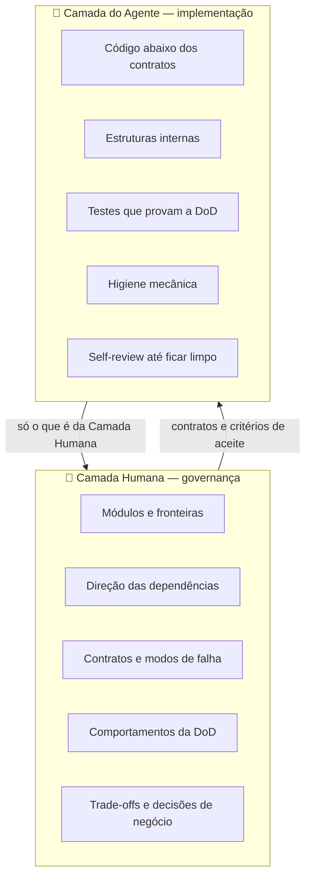
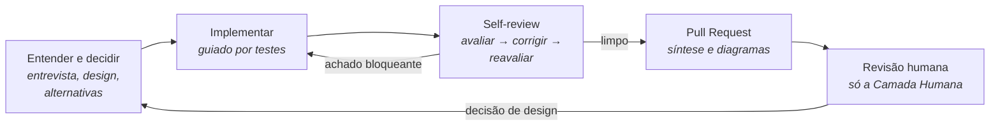

# ai-skills

O meu jeito de desenvolver software com agentes de IA, escrito como **skills** e instalado a partir de uma fonte única em **Claude Code**, **Codex** e **Antigravity CLI**.

Mais do que um catálogo de prompts, trata-se da divisão de trabalho em que acredito: o que o humano decide e o que o agente executa sozinho. Isso passa por estruturar essas camadas e aplicar princípios de design e código que direcionem o comportamento do agente, permitindo que o humano confie no que não precisa ler e que seja chamado à atenção apenas no que realmente precisa ver e decidir.

---

## 🧭 O problema

Um agente escreve código mais rápido do que qualquer pessoa consegue ler. Revisar tudo linha a linha transforma o humano no gargalo; não revisar nada transforma o software em uma pilha de decisões que ninguém tomou: um emaranhado arquitetural feito de escolhas bem-intencionadas, mas imediatistas.

A saída que adoto é separar **o que é caro de errar e barato de revisar** do **que é barato de refazer e caro de ler**, e dar cada metade a quem faz melhor.

---

## 🧱 Duas camadas



| | 👤 Camada Humana | 🤖 Camada do Agente |
| :--- | :--- | :--- |
| **Decide** | Quais módulos existem, o que cada um promete, para onde apontam as dependências, o que é "pronto". | Como cada módulo cumpre o que promete. |
| **Revisa** | Mapas de módulos, contratos e a tabela de comportamentos, nunca o diff inteiro. | O próprio código, em loop, antes de qualquer humano ver. |
| **Recebe do outro lado** | Só o que pertence à sua camada: decisões pendentes, contratos novos, verificações manuais. | Contratos e critérios de aceite claros. |

**O teste da fronteira**, quando não está claro de quem é a decisão:

> *Mudar isso exigiria renegociar um contrato com quem chama de fora, ou dá para reescrever amanhã sem ninguém fora do módulo perceber?*
> Renegociar → 👤 humano. Reescrever em silêncio → 🤖 agente.

---

## 🔁 O ciclo de uma entrega



- **Antes de codar**, as decisões caras de mudar passam pelo humano. Quando uma decisão pesa, o agente projeta **duas vezes**, com alternativas radicalmente diferentes, e leva uma recomendação em vez de um único caminho.
- **Durante**, o agente testa primeiro sempre que há um comportamento observável e um jeito de testá-lo.
- **Antes do humano**, o agente revisa a si mesmo com orçamento e limite de rodadas: corrige o bloqueante, corrige o que tem cenário concreto de dano, descarta preferência de estilo e **escala** o que mexeria num contrato.
- **Na revisão**, o humano vê o que foi construído contra o que foi pedido, em diagramas e numa tabela de comportamentos, e não num mar de linhas.

Uso as mesmas lentes no trabalho dos outros: revisar o PR de um colega, responder à revisão recebida, resolver um conflito entre trabalhos paralelos sem descartar nenhum dos dois.

---

## 📚 As teorias por trás

Não deixo o critério ao acaso. Cada julgamento de design ou de código se apoia numa ideia com nome, tirada dos livros que adotei como referência, para que o achado seja "isto é um módulo raso" e não "eu faria diferente".

| Fonte | O que adotei | Onde aparece |
| :--- | :--- | :--- |
| **John Ousterhout**, *A Philosophy of Software Design* | Complexidade como o inimigo central (dependências e obscuridade). **Módulos profundos**: interface pequena, implementação rica. Ocultação de informação e vazamento. Puxar a complexidade para baixo. Definir erros fora da existência. Camada diferente, abstração diferente. Programação **estratégica** em vez de tática. **Design it twice**. Comentários que dizem o porquê. | Todo o design e a revisão de arquitetura. |
| **Robert C. Martin**, *Clean Architecture* | A regra de dependência: **as dependências apontam para as regras de negócio**; a política nunca depende de banco, framework ou provedor. | Direção de dependências, na Camada Humana. |
| **Martin Fowler**, *Refactoring* | O catálogo de **code smells** e de refatorações nomeadas, em passos pequenos, sempre com testes verdes, sem misturar com mudança de comportamento. | Qualidade abaixo dos contratos. |
| **Kent Beck**, *Test-Driven Development* | **Red → green → refactor.** Um teste que nunca falhou não prova nada. | Implementação. |
| **Escola clássica de testes** (Vladimir Khorikov, *Unit Testing Principles, Practices, and Patterns*) | A unidade de teste é um **comportamento observável pela interface pública**. Colaboradores internos rodam de verdade; dublês só para o que está fora do controle (rede, relógio, LLM). Teste que quebra numa refatoração é teste ruim. | Testes e revisão de testes. |

Onde as escolas discordam, declaro minha posição. Um exemplo: entre as funções minúsculas do *Clean Code* e as funções longas e profundas de Ousterhout, a regra que sigo é extrair **quando o pedaço extraído é independente**, e não extrair quando isso só espalha o que precisa ser lido junto.

Algumas práticas de trabalho com agentes (entrevistar em rodadas sobre uma árvore de decisões, prototipar o que conversa não resolve, fazer handoff entre sessões) vêm das [skills de Matt Pocock](https://github.com/mattpocock/skills), adaptadas ao meu fluxo.

---

## 🧩 O que as skills têm em comum

- **O agente propõe, o humano decide.** Nada sai para o mundo (push, comentário, issue, mensagem) sem confirmação explícita.
- **Fatos são trabalho do agente; decisões são do humano.** O agente não pergunta o que pode descobrir sozinho, e não responde às próprias perguntas de decisão.
- **Achado precisa de cenário concreto.** Julgamento sem um bug provável, uma mudança cara ou uma confusão real do leitor é preferência, e preferência não vira achado.
- **Mostrar antes de descrever.** Estrutura, dependências, fluxos e conflitos aparecem como diagrama, numa notação única.
- **Nada que o leitor não consiga abrir.** Commits, PRs e comentários nunca citam caminhos locais da máquina.
- **Escrita de gente.** Texto que um colega vai ler passa por uma revisão contra os vícios de escrita de IA.
- **Toda skill diz como verificar que deu certo.**

O catálogo atual está em [`skills/`](skills/). Ele muda com o tempo; a filosofia acima é o que deve permanecer.

---

## 🚀 Instalação

| Harness | Regras (SSOT) | Skills no projeto | Skills globais |
| :--- | :--- | :--- | :--- |
| **Claude Code** | `CLAUDE.md` → `AGENTS.md` | `.claude/skills/` | `~/.claude/skills/` |
| **Codex** | `AGENTS.md` | `.agents/skills/` | `~/.codex/skills/` |
| **Antigravity CLI** | `AGENTS.md` ou `GEMINI.md` | `.agents/skills/` | `~/.gemini/config/skills/` |

### Global (recomendado)

```bash
./scripts/setup-global.sh
```

1. Vincula, por symlink, cada skill de `skills/` nas três pastas globais. Uma pasta real com o mesmo nome (cópia antiga) é movida para `~/.ai-skills-backup/<data>/` antes de o link ser criado, e links para skills que saíram do repositório são removidos.
2. Pergunta se deve vincular o [`AGENTS.md`](AGENTS.md) como instrução global dos três harnesses, com backup dos arquivos existentes. Rode num terminal interativo para responder.

Como tudo é symlink, um `git pull` já atualiza as skills em todos os harnesses. Rode o script de novo só quando skills forem adicionadas ou removidas.

### Num projeto específico

```bash
./scripts/link-project.sh /caminho/para/o-projeto
```

1. Cria um `AGENTS.md` base, se não houver, e aponta `CLAUDE.md` e `GEMINI.md` para ele.
2. Aponta `.claude/skills` e `.agents/skills` para `skills/`. Se o projeto já tiver skills próprias, elas são preservadas e as deste repositório são vinculadas uma a uma, sem sobrescrever homônimas.

---

## ✍️ Criando uma skill

O padrão completo está no [`AGENTS.md`](AGENTS.md), seção 3. Em resumo:

```text
skills/<nome-em-kebab-case>/
├── SKILL.md       # obrigatório: frontmatter (name, description) + instruções
├── references/    # detalhe carregado sob demanda
├── scripts/       # utilitários executáveis
└── resources/     # templates e ativos
```

- A `description` diz, em 3ª pessoa, o que a skill faz e **quando** deve ser acionada.
- O `SKILL.md` fica enxuto; o aprofundamento vai para `references/`.
- Toda skill termina com uma seção de **Validação de Sucesso**.
- Depois de criar, rode `./scripts/setup-global.sh`.
