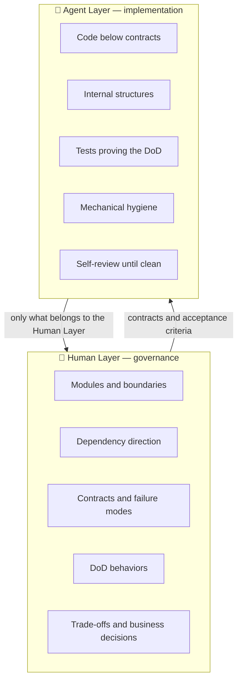
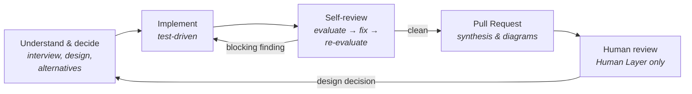

# ai-skills ✨

A curated, public distillation of my approach to AI-assisted software engineering. Packaged as universal **skills** installed from a single source across **Claude Code**, **Codex**, and **Antigravity CLI**.

This project shares an opinionated baseline for AI pair programming: assigning what is expensive to get wrong to the human (architecture, contracts, boundaries) and what is expensive to read to the agent (mechanics, test suites, self-review).


## 🧭 The Problem

An agent writes code faster than any human can read. Reviewing everything line-by-line turns the human into a bottleneck; reviewing nothing turns software into a pile of decisions no one actually made: an architectural tangle of well-intentioned but short-sighted choices.


## 🧱 Two Layers



| | 👤 Human Layer | 🤖 Agent Layer |
| :--- | :--- | :--- |
| **Decides** | Which modules exist, what each promises, where dependencies point, what defines "done". | How each module fulfills its promises. |
| **Reviews** | Module maps, contracts, and the behavior table—never the entire diff. | Its own code, in an automated loop, before any human sees it. |
| **Receives from the other side** | Only what belongs to its layer: pending decisions, new contracts, manual verifications. | Clear contracts and acceptance criteria. |

**The boundary test**, whenever it is unclear who owns a decision:

> *Would changing this require renegotiating a contract with external callers, or can it be rewritten tomorrow without anyone outside the module noticing?*
> Renegotiate → 👤 human. Silently rewrite → 🤖 agent.


## 🔁 The Delivery Cycle



- **Before coding**, high-consequence decisions pass through the human. When a decision carries heavy weight, the agent designs **twice**, exploring radically different alternatives, and brings a recommendation instead of a single path.
- **During**, the agent writes tests first whenever an observable behavior and a way to test it exist.
- **Before the human**, the agent reviews itself with an iteration budget and limit: fixes blocking issues, fixes anything with a concrete failure scenario, discards style preferences, and **escalates** anything that would touch a contract.
- **In review**, the human evaluates what was built against what was requested, in diagrams and a behavior table, rather than wading through a sea of lines.

I use the same lenses for collaborating on other people's work: reviewing a peer's PR, responding to received reviews, and resolving conflicts between parallel branches without discarding either work.


## 📚 The Theories Behind It

I don't leave criteria to chance. Every design or code judgment is grounded in an established concept with a name, drawn from foundational reference books, so findings are "this is a shallow module" rather than "I would have done it differently".

| Source | What was adopted | Where it appears |
| :--- | :--- | :--- |
| **John Ousterhout**, *A Philosophy of Software Design* | Complexity as the central enemy (dependencies and obscurity). **Deep modules**: small interface, rich implementation. Information hiding and leakage. Pulling complexity downwards. Defining errors out of existence. Different layer, different abstraction. **Strategic** rather than tactical programming. **Design it twice**. Comments that explain why. | All software design and architecture review. |
| **Robert C. Martin**, *Clean Architecture* | The dependency rule: **dependencies point toward business rules**; policy never depends on databases, frameworks, or external providers. | Dependency direction, on the Human Layer. |
| **Martin Fowler**, *Refactoring* | The catalog of **code smells** and named refactorings, in small steps, always with green tests, never mixed with behavioral changes. | Code quality below contracts. |
| **Kent Beck**, *Test-Driven Development* | **Red → green → refactor.** A test that has never failed proves nothing. | Implementation. |
| **Classical Testing School** (Vladimir Khorikov, *Unit Testing Principles, Practices, and Patterns*) | The unit of testing is an **observable behavior via public interface**. Internal collaborators run for real; test doubles only for things outside process control (network, system clock, LLMs). A test that breaks upon refactoring is a bad test. | Testing and test review. |

Where schools diverge, I state my position. For instance: between the tiny functions of *Clean Code* and the deep, cohesive functions of Ousterhout, my rule is to extract **when the extracted piece is independent**, avoiding extractions that merely scatter what should be read together.


## 🧩 What the Skills Have in Common

- **The agent proposes, the human decides.** Nothing goes out to the world (push, comment, issue, message) without explicit confirmation.
- **Facts are the agent's job; decisions belong to the human.** The agent doesn't ask what it can discover on its own, and doesn't answer its own decision questions.
- **Findings require concrete failure scenarios.** Judgment without a probable bug, an expensive change, or real reader confusion is preference, and preference does not become a finding.
- **Show before describing.** Structure, dependencies, flows, and conflicts are visualized as diagrams using consistent notation.
- **Nothing the reader cannot open.** Commits, PRs, and comments never reference local machine paths.
- **Human writing.** Text meant for human teammates undergoes review against formulaic AI writing habits.
- **Every skill specifies how to verify success.**

The current catalog is in [`skills/`](skills/). It evolves over time; the philosophy above is what remains.


## 🙏 Credits

Three skills come from [Matt Pocock's skills](https://github.com/mattpocock/skills).

| Skill | Original | What changed |
| :--- | :--- | :--- |
| `grill-me` | [`grilling`](https://github.com/mattpocock/skills/blob/main/skills/productivity/grilling/SKILL.md), [`grill-me`](https://github.com/mattpocock/skills/blob/main/skills/productivity/grill-me/SKILL.md) | **Transposition.** His two skills merged into one, in this repository's format. |
| `handoff` | [`handoff`](https://github.com/mattpocock/skills/blob/main/skills/productivity/handoff/SKILL.md) | **Transposition, plus additions:** when a handoff is justified, and verified facts kept apart from assumptions. |
| `prototype` | [`prototype`](https://github.com/mattpocock/skills/blob/main/skills/engineering/prototype/SKILL.md) | **Adaptation.** The UI branch builds a standalone mockup outside the repository, with the project's design system, instead of variants on an app route. |

Compared against upstream at the time of the port; later changes there are not tracked.


## 🚀 Installation

| Harness | Rules (SSOT) | Project skills | Global skills |
| :--- | :--- | :--- | :--- |
| **Claude Code** | `CLAUDE.md` → `AGENTS.md` | `.claude/skills/` | `~/.claude/skills/` |
| **Codex** | `AGENTS.md` | `.agents/skills/` | `~/.codex/skills/` |
| **Antigravity CLI** | `AGENTS.md` or `GEMINI.md` | `.agents/skills/` | `~/.gemini/config/skills/` |

### Global (recommended)

```bash
./scripts/setup-global.sh
```

1. Symlinks each skill from `skills/` into the three global folders. Any real folder with the same name (legacy copy) is moved to `~/.ai-skills-backup/<timestamp>/` before the link is created, and dangling links to skills removed from the repo are pruned.
2. Prompts whether to link [`global/AGENTS.md`](global/AGENTS.md) as the global instruction across the three harnesses (`~/.claude/CLAUDE.md`, `~/.codex/AGENTS.md`, `~/.gemini/GEMINI.md`, and `~/.gemini/config/AGENTS.md`). Existing files are moved to the same backup. Use `--global-instructions` to link without prompting, or `--skills-only` to install only the skills.

[`global/AGENTS.md`](global/AGENTS.md) is what makes the workflow mandatory across any project: it specifies, by trigger, when to load each skill (for example, `coding` before editing any code file). The root [`AGENTS.md`](AGENTS.md) serves strictly to maintain this repository.

Because everything is symlinked, a `git pull` instantly updates skills and instructions across all harnesses. Re-run the script only when skills are added or removed.

### In a specific project

```bash
./scripts/link-project.sh /path/to/project
```

1. Creates a baseline `AGENTS.md` if one doesn't exist, and points `CLAUDE.md` and `GEMINI.md` to it.
2. Points `.claude/skills` and `.agents/skills` to `skills/`. If the project already has its own skills, they are preserved and skills from this repo are symlinked individually without overwriting homonyms.


## ✍️ Creating a Skill

The full standard is in [`AGENTS.md`](AGENTS.md), section 3. In summary:

```text
skills/<kebab-case-name>/
├── SKILL.md       # required: frontmatter (name, description) + instructions
├── references/    # in-depth guidance loaded on demand
├── scripts/       # executable utilities
└── resources/     # templates and assets
```

- The `description` states in 3rd person what the skill does and **when** it should be triggered.
- Keep `SKILL.md` lean; deep-dive material belongs in `references/`.
- Skills and documentation are authored in English by default.
- Every skill ends with a **Success Validation** section.
- After creating, run `./scripts/setup-global.sh`.


## 📄 License

This repository is licensed under the [Creative Commons Attribution-NonCommercial 4.0 International](LICENSE) (CC BY-NC 4.0) license. You are free to share and adapt the materials for non-commercial purposes with appropriate attribution.

