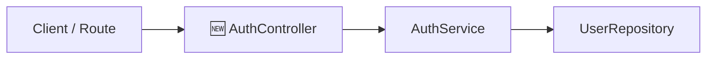

# GitHub Pull Request

Skill for structuring, documenting, and opening Pull Requests on GitHub.

---

## 1. Pull Request Principles

- **Designed for the Reviewer**: The reviewer must understand the purpose of the PR within the first 5 seconds of reading.
- **Focus on High-Level Review**: Grounded in the philosophy of [`ai-assisted-software-development`](../ai-assisted-software-development/SKILL.md) and [`human-review`](../human-review/SKILL.md). Do not clutter the PR with internal implementation minutiae already validated by [`agent-self-review`](../agent-self-review/SKILL.md).
- **Visuals via `visualize-it`**: Mermaid diagrams clearly communicate boundaries and contracts.

---

## 2. Issue Linkage and Traceability

Every PR should ideally be linked to a tracking issue to keep the team informed and preserve project history.

### Agent Workflow:
1. **If an issue exists in context** (Jira, GitHub Issues, Linear, etc.):
   - Link the identifier and URL in the PR traceability section.
   - Link every issue the PR resolves, not only the main one.
2. **If NO issue exists in context**:
   - **The agent must proactively recommend**:
     > *"This PR does not yet reference a tracking issue. I recommend creating an issue (in GitHub Issues, Jira, or your preferred tracker) to keep teammates informed about this work. Would you like to create an issue before we open the PR?"*
   - If the user wishes to create one, the agent assists or waits.
   - If the user opts out, the PR proceeds without an issue link.

### Supporting References

Beyond the issue, the traceability section records where the work came from and what it connects to, so any reader can follow the trail without asking:

| Reference | What it links |
| :--- | :--- |
| **Origin** | The report or discussion that started the work (user report, support thread, team conversation). |
| **Error** | The monitored error or alert the PR addresses. |
| **Related PRs** | Companion changes in other repositories or layers. |
| **Other** | Design docs, decision records, mockups, recordings, dashboards, or queries. |

- **Gather before asking**: look in the conversation, the branch, the commits, and the issue itself (description and comments, when a tracker tool is available); the origin and error links usually live there.
- **Ask once, only on evidence**: if a reference is clearly implied but its link is missing (e.g., a bug reported by a user with no link to the report), bundle all missing links into a single question.
- **Label every link** with what it is (e.g., `[support report on checkout failure](<url>)`), never a bare URL.
- **Include only lines that have a link**: omit empty categories instead of writing "N/A".
- Every link must be reachable by the reader ([no-local-references](../ai-assisted-software-development/references/no-local-references.md)).

---

## 3. PR Title Format

```text
Type/Concise Description
```
*Accepted Types:* `Feat/`, `Fix/`, `Refactor/`, `Chore/`, `Perf/`, `Docs/`.
*Examples:*
- `Feat/Refresh token authentication and key rotation`
- `Fix/Intermittent timeout on payment gateway call`
- `Refactor/Isolate order repository persistence`

> **Convention note**: PR titles use a PascalCase prefix followed by a description in the team/repository language for triage on GitHub, while individual commits strictly adhere to English Conventional Commits (`feat(auth): ...`).

---

## 4. PR Description Template (Body)

Use the structure below:

```markdown
## Summary
[In 1 or 2 direct sentences, explain what this PR does and why it exists from the reader's perspective. Be direct: what does the system do now that it did not do before?]

---

## Traceability & Issue
- **Issue**: [Link and issue key, e.g.: `#42` or `PROJ-123`] (short summary of the issue) *(or "N/A - Authorized standalone work")*
- **Origin**: [Labeled link to the report or discussion that started the work]
- **Error**: [Labeled link to the monitored error or alert]
- **Related PRs**: [Labeled links, e.g.: `#1235 (frontend)`]
- **Other**: [Labeled links to docs, decision records, mockups, recordings, dashboards]
<!-- Keep only the lines that have a link; Issue is always present. -->

---

## Architecture & Contracts

<!-- Use the visualize-it skill to generate the Mermaid architecture diagram -->


- **Modules / Components**: Summary of new, modified, or removed components using [`visualize-it`](../visualize-it/SKILL.md) notation.
- **Interfaces & Contracts**: What public interfaces created/modified guarantee and how they behave on failure.
- **Dependency Direction**: Confirmation that dependencies continue pointing inward toward business rules ([dependency-direction.md](../software-designing/references/dependency-direction.md)).

---

## Delivered Behaviors (Definition of Done)

Status table mapping implemented behaviors to verification status, adhering to the legend from [`human-review`](../human-review/SKILL.md) (Section 2.3):

| Status | Delivered Behavior | Verification | Action for Reviewer |
| :---: | :--- | :--- | :--- |
| ✅ | Reject expired tokens with HTTP 401 | Unit test in `tests/auth.test.ts` | None (covered by test) |
| 🔎 | Dispatch confirmation email via real provider | Not code-testable; verified in staging | Optional to test |
| 👤 | Responsive layout for login form | Requires visual inspection | Open `/login` and verify on mobile (375px) |

*Legend: ✅ Covered by automated test · 🔎 Not code-testable, verified via alternative means · 👤 Requires manual human validation · 🚨 Missing or unverified*

---

## Impact & Breaking Changes
- [Describe API contract breaks, database migrations, or new environment variables. If none, write "None"].
```

---

## 5. PR Creation Workflow

1. **Ensure Remote is Up to Date**:
   - Verify all commits are recorded and push the branch:
     ```bash
     git push -u origin <branch-name>
     ```
2. **Review with Developer**:
   - Present the full draft of title and description for developer approval before publishing. In that conversation preview, show a terminal-native rendering of each diagram (per `visualize-it`) so it is readable; the published body keeps the Mermaid block.
3. **Create the PR**:
   - Run the command via GitHub CLI:
     ```bash
     gh pr create --draft --title "<title>" --body "<body>"
     ```
   - By default, create as `--draft` to give the developer a final pass on GitHub's interface, unless they explicitly request opening as ready for review.
4. **Output**:
   - Return the clickable GitHub PR link.

---

## 6. Success Validation

- [ ] Issue traceability was verified or agreed with the developer.
- [ ] Title follows standardized format (`Type/Description`).
- [ ] Body includes direct summary, architecture diagram (via `visualize-it`), and DoD table with official legend.
- [ ] Full draft was presented and approved by the user prior to publishing.
- [ ] PR was opened (defaulting to `--draft`) and clickable link returned.
- [ ] Supporting references found in context are listed with descriptive labels, with no empty categories.
