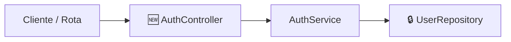

# GitHub Pull Request

Skill para estruturação, documentação e abertura de Pull Requests no GitHub.

---

## 1. Princípios do Pull Request

- **Pensado para quem revisa**: O revisor deve entender a razão de ser do PR nos primeiros 5 segundos de leitura.
- **Foco na revisão de alto nível**: Conectado à filosofia de [`ai-assisted-software-development`](../ai-assisted-software-development/SKILL.md) e [`human-review`](../human-review/SKILL.md). Não polua o PR com minúcias de implementação interna que já foram validadas pelo [`agent-self-review`](../agent-self-review/SKILL.md).
- **Visual via `visualize-it`**: Diagramas em Mermaid facilitam a visualização de fronteiras e contratos.

---

## 2. Verificação de Issue e Rastreabilidade

Todo PR deve, idealmente, estar associado a uma issue de acompanhamento para informar a equipe e manter o histórico do projeto.

### Regra de Ativação do Agente:
1. **Se houver issue no contexto** (Jira, GitHub Issues, Linear, etc.):
   - Vincule o link e o identificador na seção de rastreabilidade do PR.
2. **Se NÃO houver issue no contexto**:
   - **O agente deve alertar e recomendar proativamente**:
     > *"Este PR ainda não referencia nenhuma issue de rastreamento. Recomendo criar uma issue (no GitHub Issues, Jira ou ferramenta de sua preferência) para manter seus colegas informados sobre o trabalho. Gostaria de criar uma issue antes de abrirmos o PR?"*
   - Se o usuário desejar criar, o agente aguarda ou auxilia na criação da issue.
   - Se o usuário optar por não criar, o PR pode ser aberto sem vínculo de issue.

---

## 3. Formato do Título do PR

```text
Tipo/Breve Descrição em Português
```
*Tipos aceitos:* `Feat/`, `Fix/`, `Refac/`, `Chore/`, `Perf/`, `Docs/`.  
*Exemplos:*
- `Feat/Autenticação com refresh token e rotação de chaves`
- `Fix/Timeout intermitente na chamada do gateway de pagamento`
- `Refac/Isolamento de persistência do módulo de pedidos`

---

## 4. Modelo da Descrição do PR (Corpo)

Utilize a estrutura abaixo:

```markdown
## Resumo
[Em 1 ou 2 frases diretas, explique o que este PR faz e a sua razão de existir, pensando em quem lê. Seja direto: o que o sistema passa a fazer agora que não fazia antes?]

---

## Rastreabilidade & Issue
- **Issue**: [Link e identificador da issue, ex.: `#42` ou `PROJ-123`] *(ou "N/A - Trabalho avulso autorizado")*

---

## Camada Arquitetural e Contratos

<!-- Utilize a skill visualize-it para gerar o diagrama Mermaid de arquitetura -->


- **Módulos / Componentes**: Resumo dos componentes novos (`🆕`), alterados (`🔧`) ou removidos (`🗑️`).
- **Interfaces e Contratos**: O que as interfaces ou contratos públicos criados/alterados prometem e quais são seus comportamentos em caso de falha.
- **Direção de Dependências**: Confirmação de que as dependências continuam apontando para dentro (para a regra de negócio).

---

## Comportamentos Entregues (Definition of Done)

Tabela direta mapeando os comportamentos implementados e seu status de verificação:

| Status | Comportamento Entregue | Verificação | Ação para o Revisor |
| :---: | :--- | :--- | :--- |
| ✅ | Bloqueio de token expirado com HTTP 401 | Teste unitário em `tests/auth.test.ts` | Nenhuma (coberto por teste) |
| 🔎 | Redirecionamento após login bem-sucedido | Verificado localmente no fluxo web | Opcional testar |
| 👤 | Layout responsivo do formulário de login | Verificação visual necessária | Abrir `/login` e validar em tela mobile (375px) |

*Legenda: ✅ Testado por código · 🔎 Verificado alternativamente · 👤 Requer validação manual humana · 🚨 Alerta crítico*

---

## Impacto & Breaking Changes
- [Descreva quebras de contrato de API, mudanças de schema de banco ou variáveis de ambiente novas. Se não houver, indique "Nenhum"].
```

---

## 5. Fluxo de Abertura do PR

1. **Garantir Remote Atualizado**:
   - Verifique se todos os commits necessários foram feitos e envie a branch para o repositório remoto:
     ```bash
     git push -u origin <nome-da-branch>
     ```
2. **Revisão com o Desenvolvedor**:
   - Apresente o rascunho completo do título e da descrição para o desenvolvedor aprovar antes da publicação.
3. **Criação do PR**:
   - Execute o comando via GitHub CLI:
     ```bash
     gh pr create --draft --title "<titulo>" --body "<corpo>"
     ```
   - Por padrão, crie como `--draft` (rascunho) para permitir que o desenvolvedor dê uma última conferida na interface do GitHub, a menos que ele solicite explicitamente a abertura como PR definitivo.
4. **Retorno**:
   - Retorne o link clicável do PR gerado no GitHub.
